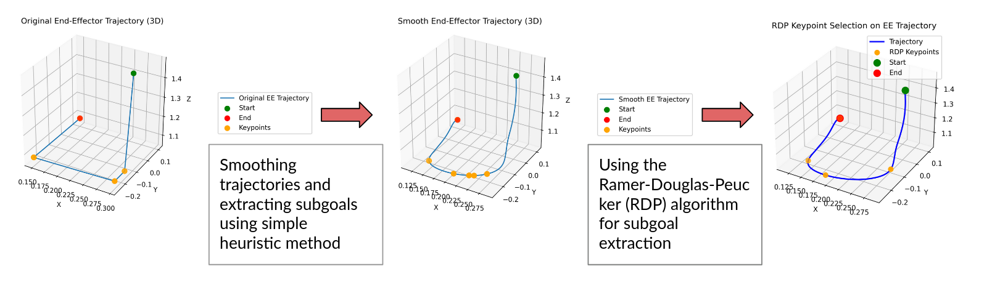

# Subgoal Decomposition on Smooth Trajectories

Subgoal extraction for robotic manipulation trajectories. 

  

## Overview

Long-horizon robotic manipulation tasks are challenging because they require reasoning over many sequential actions while maintaining consistent task progression throughout the task. Learning these behaviors using a single monolithic policy is difficult, since the policy must simultaneously reason about high-level task planning and low-level motion control.

Subgoals address this challenge by decomposing complex manipulation tasks into intermediate objectives. This decomposition reduces the effective planning horizon and provides structured guidance for low-level control policies, making long-horizon manipulation more tractable.

State-of-the-art manipulation policies on RLBench such as RVT and PerAct predict intermediate subgoals and use motion planners to generate collision-free trajectories. These methods typically rely on simple heuristic-based subgoal decomposition strategies that assume demonstrations contain explicit pauses or clear transition points, such as pre-grasp or pre-push states. While this assumption works well for standard RLBench demonstrations, it becomes problematic when trajectories are smooth and no longer contain obvious stopping points.

In this project, we investigate subgoal decomposition for smooth manipulation trajectories. We first smooth RLBench demonstrations to remove explicit pauses and transition points. We then explore trajectory-based subgoal decomposition methods, including Ramer-Douglas-Peucker (RDP), and evaluate hierarchical manipulation policies combining RVT-2 and goal-conditioned DP3 on these smooth demonstrations.

Additional implementation details, experiments, visualizations, and project updates are provided on the project website.

## Repository Structure

### RLBench-PerAct_Joint_Velocity
RLBench environment and dataset processing code. Trajectory smoothing is applied in this module to generate smooth demonstrations without explicit pauses. The main smoothing implementation is located in `pipeline_utils.py`, where Savitzky-Golay filtering is used to smooth joint velocities and end-effector trajectories.

### 3D-Diffusion-Policy-master
Contains both non-goal-conditioned and goal-conditioned DP3 implementations used as low-level manipulation policies. The main policy implementation is located in `dp3.py` and `pointnet_extractor.py`

The primary difference between the non-goal-conditioned and goal-conditioned variants lies in the encoder architecture:
- Non-goal-conditioned DP3 uses a point cloud encoder.
- Goal-conditioned DP3 uses an custom ACT3D-based encoder that jointly encodes scene point clouds and gripper pose representations to provide goal gripper pose to the model. 

### models
Contains the agent implementations used throughout the project:
- `dp3_agent.py`: goal-conditioned DP3 agent
- `dp3_agent_non_goal.py`: non-goal-conditioned DP3 baseline
- `hierarchical_agent.py`: hierarchical policy combining RVT-2 and goal-conditioned DP3

### Subgoal Extraction
Subgoal extraction is implemented through the `keypoint_discovery` function. This function is responsible for selecting keyframes/subgoals from demonstrations using different decomposition strategies, including heuristic-based selection and Ramer-Douglas-Peucker (RDP)-based trajectory simplification.

## Project Website

https://bitw1z.github.io/subgoal_decomposition_smooth_trajectories/
